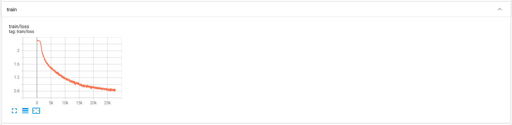
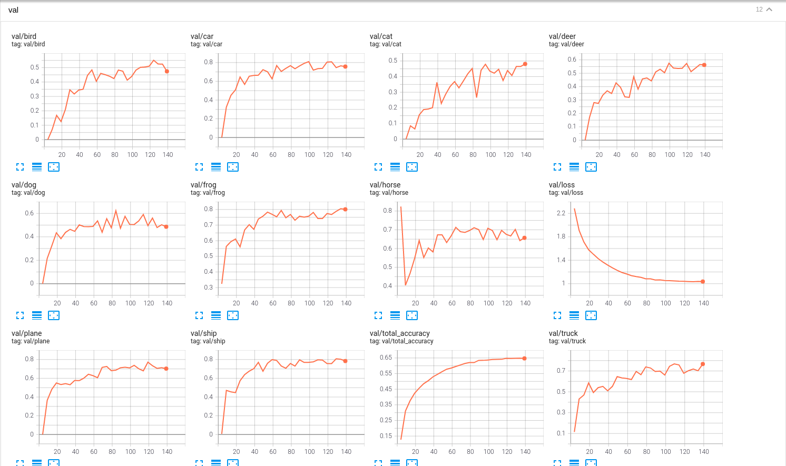

# ml-template

## Introduction

This project is a template for compute vision. And we use cifar10 as demo.

The structure of this project is described in [project_structure.md](project_structure.md).

The component relation is described in [component_reloation.md](component_relation.md)

## Installation

1. Set up the python environment:
    ```
    conda create -n ml-template python=3.7
    conda activate ml-template

    # install torch 1.5.1 built from cuda 10.1
    conda install pytorch=1.5.1 torchvision=0.6.1 cudatoolkit=10.1

    pip install -r requirements.txt
    ```

2. We use [DVC](https://dvc.org/doc/start/data-and-model-versioning) to track change of dataset, model, record, and result.

## Training

```
python train_net.py --cfg_file configs/cifar10.yaml exp.model=cifar10
```

### Tensorboard

```
tensorboard --logdir data/record/pvnet
```

If setup correctly, the output will look like




### Weights & Biases

The docs can be found at [https://docs.wandb.ai/quickstart](https://docs.wandb.ai/quickstart)

If setup correctly, the output will look like


## Testing

```
python evaluate.py --cfg_file configs/cifar10.yaml --type simple exp.model=cifar10
```

## Visualization

```
python visualize.py --cfg_file configs/cifar10.yaml --type simple exp.model=cifar10
```

If setup correctly, the output will look like


