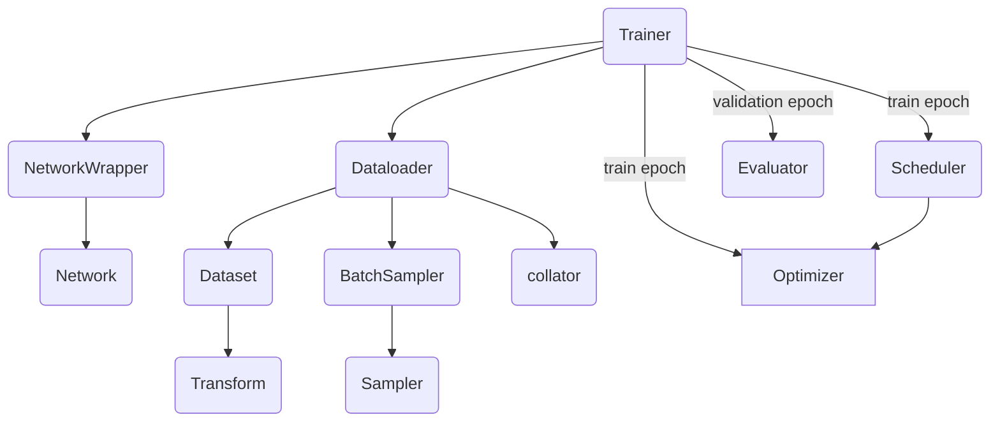

## Component Relation
**Note:** All component created by make_** function

```mermaid
graph TB
Trainer(Trainer) --> NetworkWrapper(NetworkWrapper)
Trainer -- train epoch --> Scheduler(Scheduler)
NetworkWrapper --> Network(Network)
Trainer --> Dataloader(Dataloader)
Dataloader --> Dataset(Dataset)
Dataset --> Transform(Transform)
Dataloader --> BatchSampler(BatchSampler)
BatchSampler --> Sampler(Sampler)
Dataloader --> collator(collator)
Trainer -- validation epoch --> Evaluator(Evaluator)
Trainer -- train epoch --> Optimizer
Scheduler --> Optimizer
```