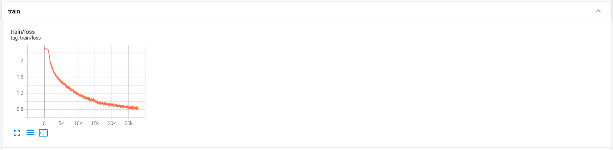
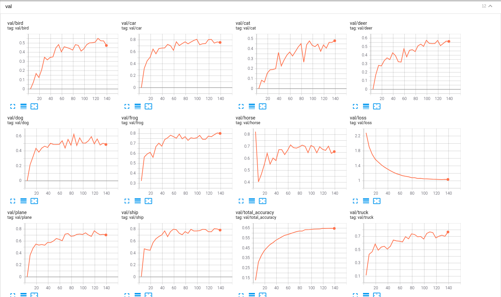

## Introduction

The project aims to achieve high reproducible and less modification. 

For a deep learning algorithm, we need some parts: dataset, network, trainer, and evaluator, network_wrapper, transform, optimizer, sampler and so on.
1. dataset: provide the data for training or testing.
2. network: the architecture of our algorithm.
3. trainer: define pipeline for training.
4. evaluator: define metrics for evaluation.
5. network_wrapper: define loss for training
6. transform: used to transform the data.
7. optimizer: define optimize algorithm.
8. sampler: define how to sample a data from whole dataset

In this project, we call all parts that a deep learning algorithm need as components, and we create them through the corresponding factories with a config file. So we have three core concepts:
1. component: a component can be every thing you need such as function, class and algorithm.
2. factory: each factory is responsible for creating a kind of components, such as networks, datasets, and trainers.
3. config: we use the factory to create specific components by specifying the configuration instead of passing parameters explicitly. So a config determines what kind of components will be created, and provides the necessary parameters for the created components.

## Config structure
In this project, config you need provided by two main `.yaml` files and command line.

### template.yaml
It provides all default configs, such as experiment information, options, configs of components. As follows:
1. experiment information:
   ```
   exp:  # experiment
     project: 'template'
     name: 'template'
     notes: 'only for template'
     job_type: 'debug'
     tags: ['demo', '${exp.task}']
     group: 'template'
     task: 'demo'
     model: 'first'
     # other
     code_version: '${cur_version:}'
     datetime: '${datetime_now: %Y-%m-%d\ %H:%M:%S}'
     fullname: '${condition: ${options.debug}, \[${exp.name}\]\[${exp.model}\]\[debug\], \[${exp.name}\]\[${exp.model}\]\[${exp.datetime}\]}'
     model_dir: 'data/model/${exp.task}/${exp.model}'
     record_dir: 'data/record/${exp.task}/${exp.fullname}'
   ```
**Note**: the used way of `${var}` and `${fun:}` can be found at [Omega Config](https://www.notion.so/Omegaconf-713fde3be0e347688994c1540a778b37#8ed87376383c472d9558b7f4b01e023f)

2. options:
   ```
   options:
     use_wandb: false
     debug: true
     gpus: [0, 1, 2, 3]
     print_runtime: false
   ```

3. a config of component:
   ```
   evaluator:
     name: 'default'
     result_dir: '${exp.record_dir}'
   ```
**Note**: It specifies which component to use by `name`, and provides `result_dir` parameter which the component needs.

### a custom `.yaml` file

Configs in a custom file will overwrite same items in a template.yaml when you need. So that you don't need to write default config again when you create a new task.

### command line

Finally, you also can specify config items through command line when you needs. For example:
```shell
python train_net.py options.debug=True
```

## Project structure

### Factory

Each kind of component has their own factory. As follows:
```
factory/
├── __init__.py
├── _factory.py
├── collator_factory.py
├── dataloader_factory.py
├── dataset_factory.py
├── evaluator_factory.py
├── network_factory.py
├── optimizer_factory.py
├── recorder_factory.py
├── scheduler_factory.py
├── trainer_factory.py
├── transform_factory.py
├── visualizer_factory.py
└── wrapper_factory.py
```

So you can create a new factory when need create a new kind of component. If you need create a new component though an existing factory, you need add the component path to corresponding components' dict. For example:
```python
_collator_component = {
    'default': ['torch.utils.data', '.dataloader', 'default_collate'],
    'my_collator': ['lib.utils.collator', '.my_collator', 'my_collator'],
}
```

### Dataset, Network, Trainer, Evaluator, Visualizer

We could define a different kind of components in corresponding dirs.

## Training and testing

Some variables in this project:
1. `$task`: denote the algorithm.
2. `$dataset_name`: denote the dataset used for training or testing, which is registered in `lib/datasets/dataset_catalog.py`.
3. `$model_name`: the model with a specific configuration.

### Testing

Test a model of our algorithm on a dataset: 
```
python evaluate.py --type simple test.dataset.name=$dataset_name options.resume=True exp.model=$model_name exp.task=$task
```

### Training

Some variables during training:
1. `$test_dataset`: the dataset used for evaluation during training.
2. `$train_dataset`: the dataset used for training.
3. `$network_name`: a specific network architecture for our algorithm `$task`.

Train a model of our algorithm on a dataset for 140 epochs and evaluate it every 5 epochs:

```
python train_net.py test.dataset.name=$test_dataset train.dataset.name=$train_dataset options.resume=False exp.model=$model_name exp.task=$task network.name=$network_name train.trainer.max_epoch=140 train.trainer.eval_ep=5
```

More training configurations can be seen in `configs/template.yaml`.

You could define the configuration with the terminal command or yaml files under `configs/`.

During training, we can watch the training losses, testing losses and dataset metrics:

```
cd data/record
tensorboard --logdir $task
```
Or use [https://docs.wandb.ai/quickstart](https://docs.wandb.ai/quickstart)

The losses are defined in the network_wrapper, and the metrics are defined in the evaluator.

## Experiment tracking

In order to make our experiment more reproducible, we use some tools to track the experiment.

1. git: tracking our codes

    ```
    git status
    git add .
    git commit -m "message"
    git push
    ```

   the commit template we used:
   ```
   # Type(<scope>): <subject>


   # <body>


   # <footer>

   # type 字段包含:
   # feat：新功能（feature）
   # fix：修补bug
   # docs：文档修改（documentation）
   # style： 代码格式修改（不影响代码运行的变动）
   # refactor：代码重构（即不是新增功能，也不是修改bug的代码变动）
   # test：测试用例修改
   # chore：其他修改, 比如构建流程, 依赖管理，或辅助工具的变动
   #
   # scope用于说明 commit 影响的范围，比如数据层、控制层、视图层等等。                                                                                                         
   #
   # subject是 commit 目的的简短描述，不超过50个字符
   #
   # Body 部分是对本次 commit 的详细描述，每行不超过70个字符，可以分成多行
   # 50/70规则参见：
   # https://stackoverflow.com/questions/2290016/git-commit-messages-50-72-formatting
   #
   # Footer用来关闭 Issue或以BREAKING CHANGE开头，后面是对变动的描述、
   #       以及变动理由和迁移方法
   ```

2. tensorboard or wandb: tracking training and test of experiment  

   
   

3. [DVC](https://dvc.org/doc/start/data-and-model-versioning): tracking our datasets and models.
   ```
   dvc init
   dvc add data/model
   git add data/model.dvc
   git commit -m "add model data"
   git push
   dvc push
   
   git checkout <...>
   dvc checkout
   ```
